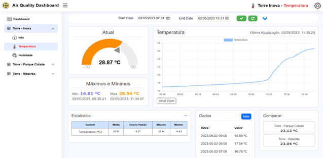
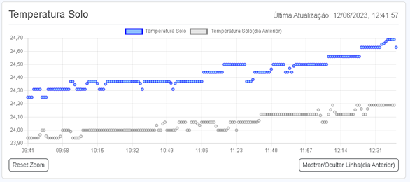

# meteo

The "Air Quality Monitoring Application" is a user-friendly software solution designed to track and assess air quality in real-time. It offers valuable insights into various air pollutants, such as particulate matter (PM2.5 and PM10), carbon monoxide (CO), nitrogen dioxide (NO2), and ozone (O3), Temperature, etc. Users can access up-to-date air quality data.

Key Features:

Real-time Data Visualization: Users can view air quality data in intuitive and informative graphical formats, including line charts, gauge charts, etc. This feature allows for quick and easy interpretation of air quality trends.

Variable Time Scale: The application provides flexibility in choosing the time scale for data visualization. Users can zoom in to view data by the hour, day, week, or month, allowing for a granular analysis of air quality changes over time.

Comparison Across Zones: Users can compare air quality data from different geographical zones or regions where meteorological towers are installed. This feature enables users to assess variations in air quality across locations and make informed decisions accordingly, with meteorological towers currently installed in Vila Nova de Famalicão.

Historical Data Access: The application maintains a historical database of air quality data, allowing users to access past records for research, trend analysis, or reporting purposes.

Alerts and Notifications: Users will soon be able to set up customized alerts based on predefined air quality thresholds. When air quality levels exceed or fall below these thresholds, the application will send notifications, ensuring that users are informed of potential health risks. Please note that this feature is currently under development and is a future objective of the application.

Meteorological Tower Integration: The application seamlessly integrates data from meteorological towers, providing additional insights into weather conditions, which can impact air quality. This data enhances the overall understanding of environmental factors.

User-Friendly Interface: The user interface is designed for ease of use, making it accessible to a wide range of users, including individuals, communities, and environmental organizations.

Currently **under development.**

http://lab.fam.ulusiada.pt/meteo/

cd Meteo

npm install

npm start / node sql.cjs
